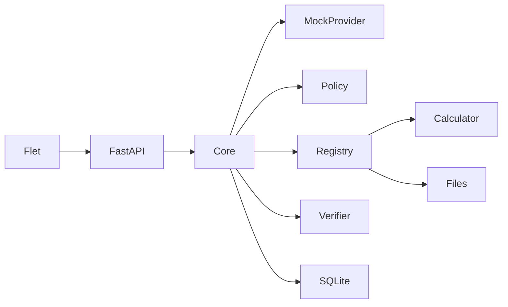
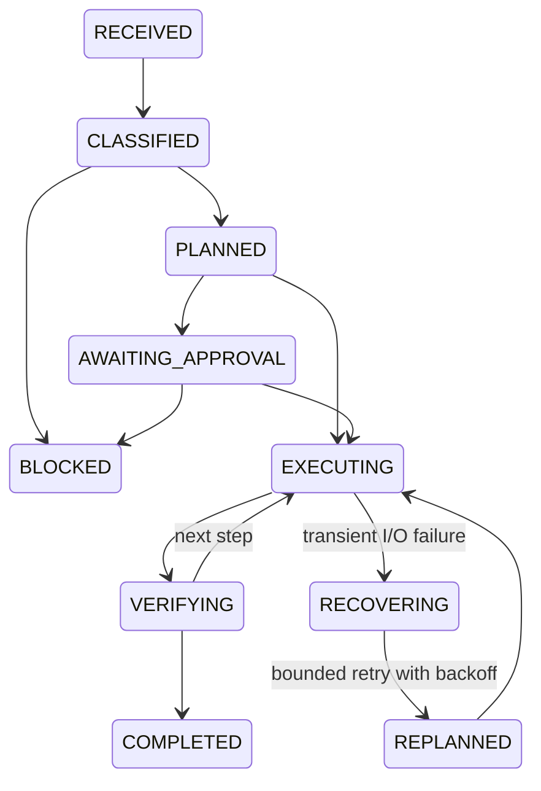

# NEXORA project specification

NEXORA: An Autonomous Multimodal Personal AI Agent for Goal-Based Task Planning,
Tool Selection, and Cross-Application Execution. This Computer Science FYP studies
reliable goal decomposition and tool selection with explainable verification, recovery,
approval, and user-controlled memory. Explain changes in simple English.

## Current acceptance: Phases 0 and 1

User-authorized current extension: saved multi-turn conversations, Gemini as the main online
provider, Mock fallback, and push-to-talk with faster-whisper and pyttsx3.
This explicit scope supersedes the older phase order for voice only; no browser, image,
video, screen capture or unrestricted desktop tools. Mock remains default. Keep existing
task APIs and safe tools. Destructive filesystem tools remain unavailable and fail closed.
Audio must stay transient, with explicit recording start, stop, cancellation and mute.
Speech is AI-generated. Gemini keys stay in ignored local `.env`; paid OpenAI is unavailable.

- Python 3.11+, Flet UI, FastAPI API, Pydantic settings/models, SQLAlchemy SQLite.
- No API key or runtime internet required; deterministic mock plans.
- Health, create/read/list/run/cancel tasks, audit polling, tools, approve/reject endpoints.
- Calculator without eval; approved-workspace text file list/read/search, no writes.
- Explicit transitions, bounded retries, run/tool deadlines, cooperative cancellation.
- Persist tasks, ordered plans, evidence, audit events, exact-action approvals.
- UI shows goal, plan, activity/evidence, approval, history, and Stop.
- A clearly labeled approval simulation changes only the task's own database record.
- Verify evidence, reject unsupported goals, and never imply mock intelligence is real AI.
- Passing offline tests and Ruff; documented Windows setup.

## Safety and architecture

UI talks only to local API. Core uses a provider protocol and registered tools.
Low risk executes; medium/high requires exact approval; critical is blocked.
Reject traversal, symlink escape, non-text types, oversized files and unsafe arithmetic.
No real state-changing external tool in Phase 1. Never execute retrieved instructions.
Bind service to loopback. No secrets or raw tool inputs in audit logs.
SQLite task history is distinct from future explicit durable memory.

## Numbered roadmap

Active states can also end as FAILED, CANCELLED or TIMED_OUT. Phase 1 recovery
retries transient I/O only; it does not invent a new strategy or retry failed verification.

0. Assessment, source-of-truth docs, configuration, packaging and smoke checks.
1. Free deterministic vertical slice described above.
2. Complete MVP: PDF, sourced mock/real search, controlled memory CRUD/disable/export,
   optional OpenAI through provider interface, all MVP screens, secret/error hardening.
   Exactly five MVP tool families; at least 20 meaningful tests; provider switching.
3. Research with claim/source evidence, allowlisted Playwright actions, initial benchmark.
4. Push-to-talk/editable voice and on-demand screen understanding with privacy defaults.
5. 50–100 versioned benchmark tasks, baseline comparison, actual CSV/JSON metrics,
   reproducible charts, packaging and FYP demo documentation.

Later features must not be built before their phase. No unrestricted computer control,
automatic payments, account changes, mass messages, or unrestricted downloaded code.
Evaluate success, plan/tool accuracy, failure detection/recovery, interventions, time,
safety, memory accuracy, and cost. Never invent results.
